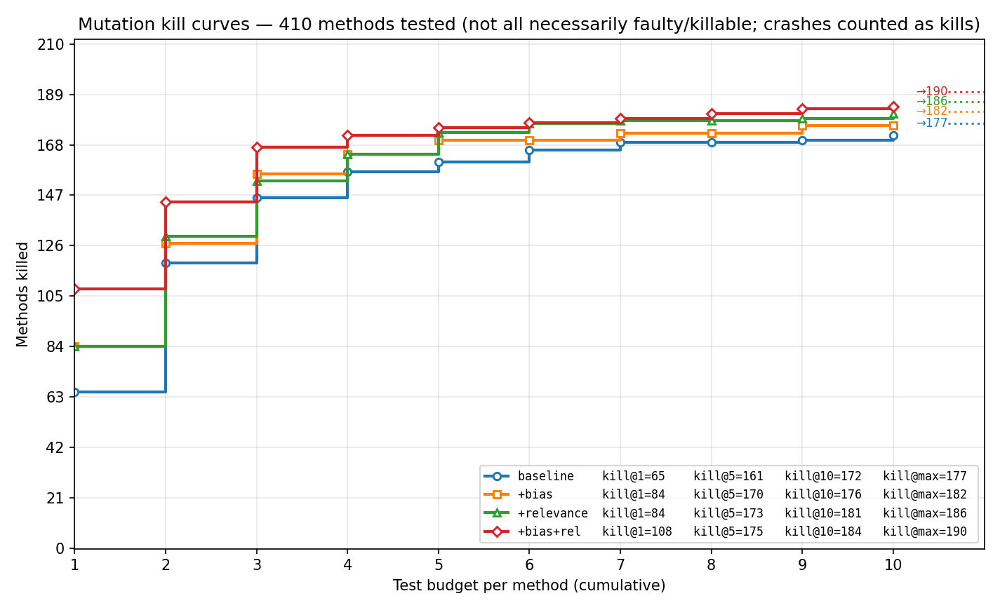
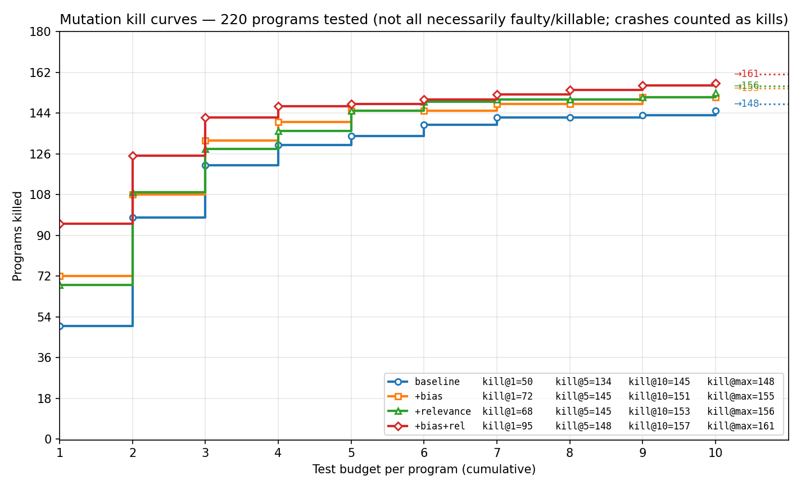
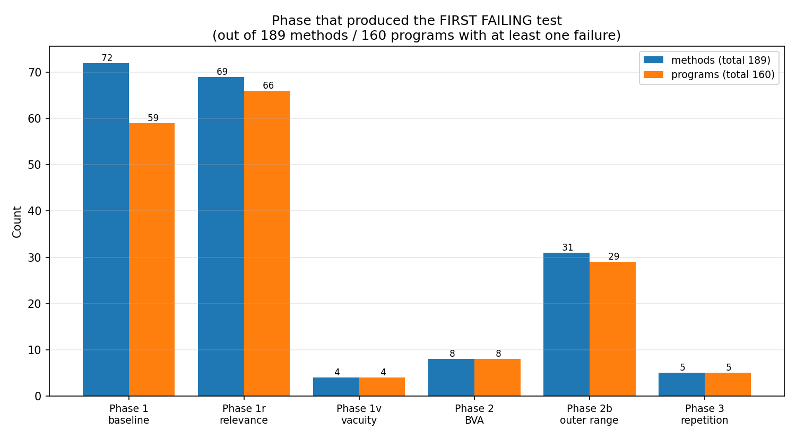
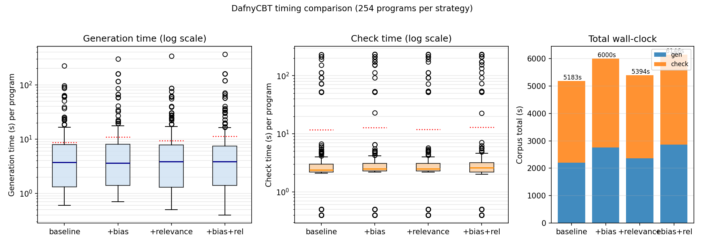

# Empirical evaluation

Ablation study on the **buggy_progs** corpus, measuring the contribution of DafnyCBT's two optional refinements (ON by default) — anti-trivial **bias**, and per-literal **relevance check** — to mutation kill rate, kill@k, and wall-clock time. Optional features with negletible impact are also discussed in the end.

## Corpus

[`test/buggy_progs/in/`](../test/buggy_progs/in/) — 314 programs, 409 methods.

**Provenance**: 313 of the 314 programs are specifications from the **DafnyBench** benchmark suite [\[1\]](#ref-dafnybench) (a public collection of Dafny programs assembled from open-source Dafny repositories and student projects), each mutated with a single seeded operator per file by **MutDafny** [\[2\]](#ref-mutdafny) — a dedicated mutation tool for Dafny. The mutation kind is encoded in the filename suffix (`EVR_int`, `MVR`, `SDL`, `ROR_Eq`, `LVR`, `AOI`, `BBR`, `AOR_Sub`, `ODL_Mul`, `VER`, `MRR`, `MAP`, `CIR`, `CBE`, `COR`, …); the original source filename and repository are encoded in the prefix.

The remaining program — `CatalanBuggy.dfy` — is a hand-crafted spec used to illustrate an off-by-one bug in the `CatalanNumber` recurrence. It was added to the corpus to keep at least one minimal, easily-readable example for documentation purposes.

Each program contains exactly one "buggy" implementation; all generated tests should pass against the *correct* version of the same spec, and at least one test is expected to expose the mutant. The corpus mixes simple numeric methods (`abs`, `factorial`, `power`, `fibonacci`), array/sequence operations (`bubble_sort`, `insertion_sort`, `find_max`, `count_distinct`), and more elaborate spec patterns (`merge_sort`, `binary_search`, `last_position`, classified-style intervals). 91 programs end up entirely passing — either the mutant is semantically equivalent to the spec, or no test in the budget happens to expose it.

## Methodology

Each strategy emits up to **n = 10** tests per method with a **fixed Z3 random seed (42)** for cross-strategy reproducibility, runs the corpus sequentially (no `&` background), and records pass/fail per test. The runner script is [`run_tests_buggy_progs_comparison.sh`](../run_tests_buggy_progs_comparison.sh).

Strategies presented here form a 2×2 factorial of bias × relevance, with vacuity disabled in all cells (the [vacuity ablation](#vacuity) below shows it adds nothing on this corpus at this budget):

| Strategy | Flags | Bias | Relevance |
|---|---|:--:|:--:|
| `baseline` | `--no-bias --no-relevance` | OFF | OFF |
| `+bias` | `--no-relevance` | ON | OFF |
| `+relevance` | `--no-bias` | OFF | ON |
| `+bias+rel` *(= default)* | (no flags) | ON | ON |

## Mutation kill curves — per method

A method is "killed at budget k" iff the first failing test among its first k generated tests exists. The y-axis counts methods killed; the dashed-tail markers (→N) at the right edge are the asymptotic kill counts at the full budget (n = 10).



| Strategy | killed | kill@1 | kill@5 | kill@10 | kill@max | AUC |
|---|---:|---:|---:|---:|---:|---:|
| baseline | 177 | 65 | 161 | 172 | 177 | 8521 |
| +bias | 182 | 84 | 170 | 176 | 182 | 8797 |
| +relevance | 186 | 84 | 173 | 181 | 186 | 8984 |
| +bias+rel *(default)* | **190** | **108** | **175** | **184** | **190** | **9218** |

**Marginal contribution per refinement**:

| | over baseline | over the *other* refinement |
|---|---|---|
| Bias (+bias vs baseline) | kill@1 +19, kill@max +5 | kill@1 +24 (108−84), kill@max +4 (190−186) |
| Relevance (+rel vs baseline) | kill@1 +19, kill@max +9 | kill@1 +24 (108−84), kill@max +8 (190−182) |

**Interaction at kill@1 is super-additive**: the combined +bias+rel uplift over baseline (+43) exceeds the sum of individual uplifts (19 + 19 = 38) by 5 methods — bias-driven extreme inputs paired with relevance's non-vacuity requirement reach a regime neither refinement alone produces. At kill@max the two are roughly additive (5 + 9 = 14 ≈ +13 combined), with mild diminishing returns.

**Reading the curve shape**:
- **At kill@1, both refinements lift by ~+19 individually and to +43 combined** (65 → 84 → 108). Both refinements' anti-trivial / non-vacuity machinery prevents the very first test for a clause from being a degenerate `arr=[], x=0` model that absorbs many mutations.
- **Bias's marginal contribution shrinks toward the ceiling**: only +5 over baseline at kill@max, +4 over +relevance alone. Bias mostly buys *speed* — better choices early — rather than additional *coverage*.
- **Relevance's contribution is preserved at the ceiling**: +9 over baseline at kill@max, +8 over +bias alone. Relevance buys *coverage* — non-vacuous witnesses for clauses that bias's random extreme values can't reach.
- The bias-only and relevance-only curves cross multiple times in the k = 4–7 region: bias gets there faster, relevance reaches further.

## Mutation kill curves — per program

A program is "killed at budget k" iff *any* of its methods has its first failing test at local index ≤ k. This is the user-facing metric — does running DafnyCBT on a buggy program produce at least one failing test within the first k tests of any method?



| Strategy | killed | kill@1 | kill@10 |
|---|---:|---:|---:|
| baseline | 148 | 50 | 142 |
| +bias | 155 | 72 | 148 |
| +relevance | 156 | 68 | 153 |
| +bias+rel *(default)* | **161** | **95** | **158** |

Same shape as per-method, scaled to programs (each program has 1–3 methods on average).

## Phase contribution (cost-benefit)

Where do the kills come from? For each method with at least one failing test, the *first failing test*'s phase is recorded; aggregating across the corpus shows the relative contribution of each pipeline phase. Numbers below are for the **default `+bias+rel` strategy with vacuity disabled** (the same `no_vacuity` cell in the 2×2 above), so phases reflect what end-users see out of the box. The "tests" column is the total count of tests of each phase emitted across the whole corpus; "tests/fail" is the cost-benefit ratio (lower = better).



| Phase | Methods | %Fail | Programs | Tests | %Tests | Tests/Fail |
|---|---:|---:|---:|---:|---:|---:|
| Phase 1 baseline (clause witness) | 72 | 38.1% | 59 | 423 | 10.1% | **5.9** |
| Phase 1r relevance | 69 | 36.5% | 66 | 418 | 10.0% | **6.1** |
| Phase 2 BVA (refined-range) | 10 | 5.3% | 10 | 798 | 19.1% | 79.8 |
| Phase 2b outer range (categorical) | 33 | 17.5% | 31 | 1086 | 26.0% | 32.9 |
| Phase 3 repetition (seeded variants) | 5 | 2.6% | 5 | 1458 | 34.9% | 291.6 |
| **Total** | **189** | | | **4183** | | |

**Phase 1 + 1r account for 75% of first-fails using 20% of the test budget** — the spec-driven phases are by far the most efficient. Phase 2b's per-clause refined-range pinning produces the next largest slice (17% of first-fails). Phase 3 repetition is the most expensive *and* lowest-yield phase: its 35% of the budget catches just 3% of first-fails, mostly the long tail of inputs whose magnitude / length exceeds Phase 2b's tier set.

If `--min-tests` were lowered from 10 to ~5, Phase 3 would shrink dramatically without losing more than ~3% of the kills — a possible knob for budget-constrained settings.

## Wall-clock time



| Strategy | gen total (s) | gen median (s/method) | check total (s) |
|---|---:|---:|---:|
| baseline | 2206 | 3.75 | 2976 |
| +bias | 2754 | 3.60 | 3245 |
| +relevance | 2365 | 3.85 | 3030 |
| +bias+rel *(default)* | 2857 | 3.85 | 3289 |

Bias adds **~30%** to gen time over baseline; relevance adds **~7%**. Together they cost +30% gen / +10% check for +7% extra kills (177 → 190). Per-method medians stay near 4 s in all configurations — the totals differ mostly because bias triggers more retry loops on degenerate inputs.

## <a id="vacuity"></a>Vacuity ablation (separately)

The Phase 1v vacuity check ([Per-literal vacuity check in README](../README.md#per-literal-vacuity-check-enable-with---vacuity)) is **disabled by default**. On this corpus at n = 10:

- `full` (vacuity ON, with bias + relevance) kills **190** methods.
- `no_vacuity` (vacuity OFF) kills **190** methods.
- The 4 methods where Phase 1v produces the *first* failing test under `full` are caught one or two tests later by Phase 2 / Phase 2b under `no_vacuity` — same kill rate, slightly delayed.

Vacuity's value on this corpus is therefore not in raising kill rate but in *fault localisation*: a `/V{k}` test deterministically reaches an input regime where literal `Q_k` is implied by the others, providing a sharper pass/fail signal for SFL than a random-bias test. See the [README's "Role and limits" subsection](../README.md#per-literal-vacuity-check-enable-with---vacuity) and the `LastPositionTwoPaths` worked example for an SFL story where adding the `/Vi4` isolation test breaks a 3-way suspiciousness tie.

## Comparison with `dafny generate-tests`

Dafny ships a built-in test generator (`dafny generate-tests <Block|Path|InlinedBlock> <file>`) that instruments method bodies to enumerate basic blocks or execution paths and asks Z3 for inputs reaching each. We ran it on the same corpus, with the same per-program timeout (60 s gen, 120 s test) and `Block` mode (the most permissive of the three). The wrapper script that drives it — handling source preprocessing, post-hoc result classification, and producing logs in the same format — is at [`test/experimental_results/run_dafny_generate_tests.py`](../test/experimental_results/run_dafny_generate_tests.py).

### Coverage gap (which programs each tool can attempt)

| | `dafny generate-tests` (4.11.0) | DafnyCBT (no_vacuity default) |
|---|---:|---:|
| Programs producing runnable tests | **57 / 314 (18%)** | **219 / 314 (70%)** |

Why `dafny generate-tests` rejected 186 of 314 programs:

| Cause | Count |
|---|---:|
| `array<T>` / abstract / trait input parameters | 113 |
| `--enforce-determinism` (havoc, `:|`, case-`if`, nondet-`if`) | 39 |
| `--enforce-determinism` (constructor-less classes) | 6 |
| Filename contains spaces (Dafny `include` directive choke) | 11 |
| Bodyless method (warning escalated to error) | 3 |
| Internal Dafny exception or resolver failure | 7 |
| Other / location-truncated | 7 |
| **Total rejected up-front** | **186** |

Plus 26 programs skipped with parity (no method has an `ensures` clause — both tools skip), 29 where the verifier could not prove any code point reachable, and 16 where post-generation compile/runtime failed.

The headline gap is structural: the corpus is dominated by methods over `array<T>` (113 programs, 36% of the corpus), which `dafny generate-tests` rejects by design (its instrumentation cannot synthesise opaque-typed inputs). DafnyCBT translates `array<T>` to a sequence-backed SMT encoding with size tiers, so these are first-class.

### Head-to-head on the 57-program intersection

After post-comparison fixes to four DafnyCBT bugs/gaps surfaced by this study — a soundness gap in the SMT encoding of set/multiset/map literals; a method-discovery gap that missed methods declared inside named modules; the previously-missing support for non-enum / single-self-recursive algebraic datatypes (now emitted as native Z3 `(declare-datatypes …)`); and module-qualified instance construction so class methods inside named modules can be tested — the head-to-head numbers on the same 57-program intersection are:

| | Killed mutants | Kill rate within tested |
|---|---:|---:|
| `dafny generate-tests` (Block, default) | 18 | 32 % |
| DafnyCBT (no_vacuity default) | 45 | 79 % |
| Union (any tool) | 46 | 81 % |
| Intersection (both tools) | 17 | 30 % |

| Asymmetry | Programs |
|---|---:|
| Killed only by `dafny generate-tests` | 1 |
| Killed only by DafnyCBT | 28 |
| Killed by both | 17 |
| Killed by neither | 11 |

DafnyCBT kills strictly more mutants on the intersection (45 vs 18), with 28 programs unique to it that `dafny generate-tests` misses despite generating tests for them. This is consistent with the bias / relevance ablation: anti-trivial bias steers Z3 away from the small-model degenerate inputs that satisfy mutated postconditions trivially, and per-literal relevance forces every spec literal to actively prune outputs.

### Qualitative inspection: the unique-to-`generate-tests` cases

The *initial* comparison surfaced three programs where `dafny generate-tests` killed mutants DafnyCBT missed. All three turned out to correspond to fixable DafnyCBT-side gaps; each is documented here for the record.

- **`Dafny-Practice...BST__1554_MAP_1`** *(fixed)*. The methods take a parameter of recursive datatype `Tree = Empty | Node(int, Tree, Tree)`. The original DafnyCBT skipped any method whose parameter referenced a non-enum datatype. Fix: admit single-self-recursive ADTs (those whose constructors only reference primitives, enums, supported collections, and the ADT itself), emit them as native Z3 `(declare-datatypes ((Tree 0)) (((Empty) (Node (Node_0 Int) (Node_1 Tree) (Node_2 Tree)))))`, and translate constructor application (`Node(5, Empty, Empty)`), discriminators (`t.Empty?` → `((_ is Empty) t)`), and destructors (`t.left` → `(Node_1 t)`). Recursive predicates over the ADT (`BST(t)`, `NumbersInTree(t)`) are handled by the existing precondition-only / runtime-`expect` path, since `(define-fun-rec)` queries reliably return `unknown`. With the fix, this program is killed (1 PASS / 3 FAIL — the mutated `BuildBST` is correctly caught as it always returns `Empty`). Out of scope for this iteration: mutually-recursive groups, `codatatype`, and generic-parameter datatypes (`List<T>`).

- **`dafny-synthesis_task_id_455__169-191_CIR`** *(fixed)*. `MonthHas31Days(month: int) returns (result: bool) ensures result <==> month in {1, 3, 5, 7, 8, 10, 12}` with a mutation that replaces `{1, 3, 5, 7, 8, 10, 12}` with `{}` in the body. Initial diagnosis traced the miss to DafnyCBT's `<==>` decomposition combined with runtime-value injection; deeper investigation revealed the actual root cause: a soundness bug in the SMT encoding of *set / multiset / map literals*. The `In` operator handler took the wrong code path on a *literal* RHS (matching by input-name only), falling through to a sequence-search emission that used `seq.len` and `seq.nth` over an `(Array Int Bool)` value — Z3 treated those as uninterpreted functions and freely fabricated witnesses, including spurious "alternative outputs" in uniqueness rounds. Fix: detect collection kind from the expression's *type* and AST class (`SetDisplayExpr`, etc.); also expand the preamble-emission gate so `EmptySet` etc. are declared whenever the spec contains the corresponding literal (not only when an input/output has the type). With the fix, this program is killed (3 PASS / 7 FAIL).

- **`test-generation-examples...RussianMultiplication...EVR_int`** *(fixed)*. DafnyCBT reported `No testable methods found` despite the file containing `module RussianMultiplication { method mult(...) ensures res == n0 * m0 { ... } }`. Cause: method discovery walked only `program.DefaultModuleDef.TopLevelDecls` and never descended into `LiteralModuleDecl` nodes. Fix: recurse into named modules in `AllTopLevelDecls`, and prepend the enclosing module name to the call site in emitted tests (`var res := RussianMultiplication.mult(n0, m0)`). With the fix, this program is killed (2 PASS / 8 FAIL). The related limitation — methods inside *classes inside named modules* (e.g. `IntegerSet.Set`) — has also been lifted: `TestEmitter` now emits module-qualified instance construction (`var obj := new IntegerSet.Set.Set0()`) when the enclosing class lives in a non-default module, and the discovery skip for that case has been removed.

The Dafny 4.11.0 model-parser bug that prevents `generate-tests` from running on Windows at all (every program errors out with `Invalid model: invalid element name 0.0`) was confirmed across multiple flag combinations and Z3 versions; the comparison ran exclusively on WSL/Linux. That platform-specific fragility is itself a data point about the maturity of `generate-tests` for production use.

### Reproducibility (this comparison)

```bash
# Pre-requisites: WSL Ubuntu with Dafny 4.11.0 and .NET 8 SDK installed.
# (The Dafny 4.11.0 Windows build hits a Boogie model-parser bug that
# prevents generate-tests from running at all; Linux/WSL is required.)

DAFNY=~/dafny/dafny python3 test/experimental_results/run_dafny_generate_tests.py \
    test/buggy_progs/in/ \
    ~/dafnycbt_run/buggy_progs_out_dafny_gentests \
    test/buggy_progs_dafny_gentests_log.txt \
    --mode Block --timeout-gen 60 --timeout-run 120 \
    --gen-tests-extra-args='--ignore-warnings'
```

Wall-clock on the full 314-program corpus: ~60 minutes. Per-program failure causes are dumped to sibling `*.gen_error.txt` files for offline grep.

## Reproducibility

- Run script: [`run_tests_buggy_progs_comparison.sh`](../run_tests_buggy_progs_comparison.sh).
- Plotting: [`test/experimental_results/plot_kill_curves.py`](../test/experimental_results/plot_kill_curves.py), [`plot_timing.py`](../test/experimental_results/plot_timing.py), [`first_fail_phase.py`](../test/experimental_results/first_fail_phase.py).
- Raw logs (one per strategy): `test/buggy_progs_<strategy>_log.txt`. Each `Test N/M [method]: STATUS` line carries the per-method test index and verdict; `[DafnyCBT] Results: … gen=Xs check=Ys [program]` summarises the program.
- Generated tests per strategy live in `test/buggy_progs/out_<strategy>/` (excluded from the repo via `.gitignore`; regenerate locally with the run script).

## References

<a id="ref-dafnybench"></a>**[1]** Chloe Loughridge, Qinyi Sun, Seth Ahrenbach, Federico Cassano, Chuyue Sun, Ying Sheng, Anish Mudide, Md Rakib Hossain Misu, Nada Amin, Max Tegmark. *DafnyBench: A Benchmark for Formal Software Verification.* arXiv preprint arXiv:2406.08467, 2024. [arxiv.org/abs/2406.08467](https://arxiv.org/abs/2406.08467)

<a id="ref-mutdafny"></a>**[2]** Isabel Amaral, Alexandra Mendes, José Campos. *MutDafny: A Mutation-Based Approach to Assess Dafny Specifications.* In Proceedings of the 48th International Conference on Software Engineering (ICSE), 2026. [arxiv.org/abs/2511.15403](https://arxiv.org/abs/2511.15403)
