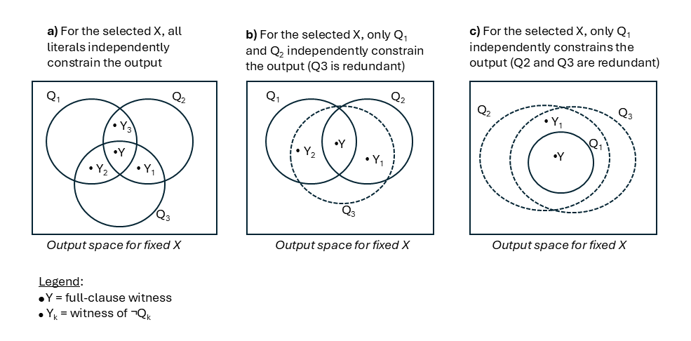

# DafnyCBT — methodology

Detailed reference for DafnyCBT's test-generation pipeline. The README gives a high-level overview and a quick-start; this page covers the algorithms, decomposition rules, BVA tiers, output-uniqueness analysis, class support, and test emission. Section structure mirrors the pipeline order.

## Vocabulary

A reader hitting "kill@1" or "Phase 1r" without context: this section defines the recurring terms.

- **DNF clause** — one disjunct of the contract's Disjunctive Normal Form. Each clause is a conjunction `Q1 ∧ Q2 ∧ … ∧ Qm` of literals (atomic spec predicates). Each clause defines an equivalence class of inputs/outputs.
- **Literal `Qk`** — one atomic predicate inside a clause (e.g. `arr[pos] == elem`, `0 <= pos`).
- **Test condition** — the (clause, optional boundary tier) pair that motivated a generated test. The emitted test carries the spec literals as a comment header.
- **Phase 1 / 1r / 1v / 2 / 2b / 3** — the six pipeline stages of the progressive-auto strategy. See [Phase architecture](#phase-architecture) below.
- **kill@k** — the number of methods whose first failing test is among the first `k` generated tests for that method (per-method local index). A higher kill@k means more bugs caught earlier in the budget. **kill@max** = the asymptotic count when `k = n` (the configured budget).
- **Tests/fail** — total tests of a phase emitted across the corpus, divided by the number of methods whose first-fail came from that phase. A cost-benefit ratio: lower = the phase contributes more first-fails per test it costs.
- **First-fail** — the first failing test in a method's test sequence (per-method local index). Used to attribute kills to specific phases.

## Phase architecture

DafnyCBT generates tests through a **progressive escalating pipeline**: each phase only runs if the previous phases haven't reached `--min-tests` (default 4). Phases:

| # | Name | Purpose | Tested in our corpus | Default |
|--:|---|---|--:|:--:|
| 1 | **Baseline DNF clause** | One concrete witness per DNF clause | always | ON |
| 1r | **Relevance check** | Replace the Phase 1 query with one that forces every safe literal to non-trivially prune outputs | when `--no-relevance` is not set | ON |
| 1v | **Vacuity check** (CEGIS) | Find inputs where one literal is vacuously true — *for fault localisation*. Tries isolated witnesses first, falls back to non-isolated automatically | only with `--vacuity` | OFF |
| 2 | **Refined-range BVA** | Per-clause-per-variable boundaries derived from clause literals | when budget remaining | ON |
| 2b | **Type/size coverage** | Categorical tiers (`=0`, `>0`, `<0`; `\|s\|=0`, `\|s\|=1`, `\|s\|=2`, `\|s\|≥3` at default `--tiers 4`; enum constructors; mutation pre/post) | when budget remaining | ON |
| 3 | **Round-robin repetition** | Distinct alternatives per base (one query per base per round); alternates plain repeats with genuine relevance-style repeats when a `/Rel` witness exists; bases drop on plain UNSAT; cross-base input dedup with retry | when budget remaining | ON |
| post | **Vacuity annotation** | Per-test scan tagging every vacuous `Qk` with `// VACUOUSLY TRUE` for SFL precision | always | ON |

Phases 1 and 1r occupy **the same slot** — for each clause, 1r's enhanced SMT query is tried first; on UNSAT or unknown the plain Phase 1 query is the fallback. Phases 1v, 2, 2b, 3 add tests to the per-method test set in that order.

For empirical contributions of each phase, see [`empirical-evaluation.md`](empirical-evaluation.md).

---

## Equivalence Class Partitioning via DNF Analysis

Disjunctive postconditions and preconditions naturally originate multiple test scenarios. DafnyCBT converts all contract clauses to **Disjunctive Normal Form (DNF)**, producing a set of clauses that partition the input/output space as **equivalence classes**.

### DNF vs FDNF and the `-a` flag

DafnyCBT supports two decomposition modes:

- **DNF (default)** — *short-circuit-safe*. Each disjunctive operator produces a **partition** with mutually exclusive branches. For `A || B`: branches `A`, `!A ∧ B` (not `A`, `B`). Preserves the guard order Dafny uses for short-circuit evaluation, so generated tests never reach a guarded subexpression with the guard violated.
- **FDNF (`--all-combinations` / `-a`)** — *full disjunctive normal form*. Each disjunctive operator produces all 2^N − 1 non-empty subsets of branch satisfaction. For `A || B`: branches `A ∧ B`, `A ∧ !B`, `!A ∧ B`. Generates more clauses (more test scenarios) but **drops the short-circuit-safety guarantee**: tests may evaluate guarded subexpressions where the guard is false, potentially causing runtime errors (out-of-bounds, division by zero) before the spec violation is reported.

When to choose FDNF: only if you specifically want to test all combinations of independent disjuncts (e.g., a postcondition like `IsSorted(s) || IsReversed(s)` where you want both branches simultaneously). Otherwise, the default DNF is safer and produces fewer redundant tests.

### DNF decomposition rules

The DNF decomposition respects Dafny **short-circuit evaluation** of Boolean operators, to avoid generating test cases that would cause runtime errors. Consider the following example:

```dafny
method GetFirstOrZero(a: array<int>) returns (result: int)
  ensures a.Length == 0 ==> result == 0
  ensures a.Length > 0 ==> result == a[0]
```

The implication `A ==> B` is decomposed into mutually exclusive, short-circuit safe, DNF branches `!A` and `A ∧ B` (instead of `!A` and `B` as in standard DNF). Similarly, `A || B` produces branches `A` and `!A ∧ B`. For this example, the second ensures clause produces:

- `!(a.Length > 0)` — antecedent is false, implication vacuously true
- `a.Length > 0 ∧ result == a[0]` — antecedent holds, consequent must hold

With standard (unsafe) DNF, the branch `result == a[0]` alone would lack the `a.Length > 0` guard, possibly causing an out-of-bounds error.

The following table summarises the branching rules:

| Expression | DNF Branches |
|---|---|
| `A \|\| B` | `A`, `!A ∧ B` (a) |
| `A ==> B` | `!A`, `A ∧ B` |
| `A <==> B` | `A ∧ B`, `!A ∧ !B` |
| `!(A && B)` | `!A`, `A ∧ !B` |
| `if C then A else B` | `C ∧ A`, `!C ∧ B` |
| `x == (if C then U else V)` | `C ∧ (x == U)`, `!C ∧ (x == V)` |

(a) With FDNF, the branches would be: `A ∧ B`, `A ∧ !B`, `!A ∧ B`.

Both DNF and FDNF are computed bottom-up, starting from leaf literals, by a dual-return recursive function that produces both the DNF/FDNF of an expression E and of its negation simultaneously.

### Cross-product and incremental pruning and simplification

With multiple `requires` and/or `ensures` clauses, their cross-product forms the full DNF/FDNF. After each pairwise merge, two passes are applied before the clause reaches Z3:

1. **Contradiction detection** — discards syntactically dead merges, never sending them to the solver. For each pair of relational literals on the same variable, the engine flags:
   - **Same LHS string, same RHS string, incompatible operators**: both sides matched purely on string equality of their canonical printed forms — neither side has to be a plain variable, so any pair of literals sharing the same operands fires the rule (`x == 5 ∧ x != 5`, `x == y ∧ x != y`, `arr[i] < c ∧ arr[i] >= c`, `f(y) in S ∧ f(y) !in S`). The check is symmetric in the two orientations, so `x == y ∧ y != x` is also detected. No semantic equivalence is performed: `x == y+1 ∧ x != 1+y` is missed because the strings differ.
   - **Numeric range with no overlap**: `x op1 a ∧ x op2 b` where both RHSs parse as numeric constants. Each relational literal defines an admissible interval for `x` (`x > 5` ↦ `(5, ∞)`, `x <= 10` ↦ `(-∞, 10]`, `x == k` ↦ `[k, k]`, etc.); the rule fires when the intersection of the two intervals is empty. Catches `x > 5 ∧ x < 3`, `x >= 10 ∧ x <= 5`, `x == 0 ∧ x > 0`, `x == 1 ∧ x == 2` (empty intersection of `[1,1]` and `[2,2]`), etc.

2. **Redundancy detection** — simplifies surviving clauses by collapsing redundant relational pairs.
   - **Same LHS string, same RHS string, overlapping operators** — dual of the incompatible operators rule:
     - Drop the weaker literal when a stronger one is present:
       - `a <= b` is dropped if `a == b` or `a < b` is present.
       - `a >= b` is dropped if `a == b` or `a > b` is present.
       - `a != b` is dropped if `a < b` or `a > b` is present.
     - Collapse a pair into a single literal:
       - `(a <= b) ∧ (a != b)` → `a < b`.
       - `(a >= b) ∧ (a != b)` → `a > b`.
       - `(a <= b) ∧ (a >= b)` → `a == b`.
   - **Numeric range overlap** — dual of the contradiction "no overlap" rule: when both RHSs parse as numeric constants (typically distinct), the literal whose admissible interval is a strict superset of the other's is dropped (it is implied by the tighter one). Examples:
     - `x <= 5 ∧ x < 10` → drop `< 10` (`(-∞, 5] ⊂ (-∞, 10)`).
     - `x >= 3 ∧ x > 0` → drop `> 0` (`[3, ∞) ⊂ (0, ∞)`).
     - `x == 5 ∧ x < 10` → drop `< 10` (`{5} ⊂ (-∞, 10)`).
     - `x != 10 ∧ x < 5` → drop `!= 10` (the hole at 10 is outside `(-∞, 5)`).

Negations are pre-canonicalised so the rules apply uniformly: `!(x == 0)` becomes `x != 0`, `!(x > 0)` becomes `x <= 0`, `!!X` becomes `X`, `!(X !in Y)` becomes `X in Y`.

In the `GetFirstOrZero` example above, the cross-product of the two ensures clauses in DNF mode nominally yields 4 conjunctions. After canonicalisation and the two pruning passes, contradictory merges drop out and the surviving clauses simplify:

| Cross-product merge (raw) | Post-pruning form | Verdict |
|---|---|---|
| `!(a.Length == 0) ∧ a.Length > 0 ∧ result == a[0]` | `a.Length > 0 ∧ result == a[0]` | SAT |
| `a.Length == 0 ∧ result == 0 ∧ !(a.Length > 0)` | `a.Length == 0 ∧ result == 0`| SAT |
| `!(a.Length == 0) ∧ !(a.Length > 0)` | `a.Length < 0`| UNSAT |
| `a.Length == 0 ∧ result == 0 ∧ a.Length > 0 ∧ result == a[0]` | false | Pruned |

With **FDNF**, each implication produces 3 clauses instead of 2, giving more combinations but losing short-circuit safety, namely by including the unsafe clause `a.Length == 0 ∧ result == 0 ∧ !(a.Length > 0) ∧ result == a[0]`.

### Decomposition of existential quantifiers (`--exists-decomposition` to enable)

Existential quantifiers represent repeated disjunctions, that can be also decomposed into multiple clauses. Single-variable existential quantifiers of the form `exists k :: lo <= k < hi && P(k)`, equivalent to `P(lo) || P(lo+1) || ... || P(hi-1)`, can be decomposed into **two mutually-exclusive clauses** that mirror the standard `A || B` ↦ `A`, `!A ∧ B` rule:

1. **First satisfies**: `lo < hi && P(lo)` — the property holds at the first position.
2. **First doesn't, some `k > lo` does**: `lo+1 < hi && !P(lo) && exists k :: lo+1 <= k < hi && P(k)` — the first position fails, but some later position satisfies.

Mutual exclusivity follows from `P(lo)` in clause 1 vs `!P(lo)` in clause 2, matching how DNF handles ordinary disjunction. The right-boundary case from an earlier 3-way split (`P(hi-1)`) is absorbed into clause 2's existential — in practice it rarely produced a different witness from the first-satisfies case (Z3 picks any satisfying `k` in the range, and the same anti-trivial bias / seed usually leads to the same witness). The two clauses feed into the same DNF/FDNF analysis and combine with other pre- and postcondition clauses via cross-product.

Existential decomposition is **OFF by default** (`--exists-decomposition` / `-ed` to enable). On our buggy_progs corpus at `n=10`, decomposition gains 1 unique kill (196 vs 195 methods) at the cost of ~5% wall-clock; the trade-off rarely matters for kill rate but the decomposed form is informative for SFL when a clause's structural sub-cases produce visibly distinct vacuity profiles. Without decomposition the existential is kept as a single literal in the DNF clause and Z3 picks any satisfying `k`.

Equivalent range definitions are supported. For example, `exists k :: k >= lo && k < hi && P(k)` (using two relational operators in conjunction) is recognized as the same shape as `exists k :: lo <= k < hi && P(k)` (chained inequalities) and decomposed identically. Negated `forall` quantifiers (`!(forall k :: range ==> P(k))`, equivalent to `exists k :: range && !P(k)`) are handled the same way.

Consider the following example:

```dafny
method FindMax(a: array<int>) returns (max: int)
  requires a.Length > 0
  ensures exists k :: 0 <= k < a.Length && max == a[k]
  ensures forall k :: 0 <= k < a.Length ==> max >= a[k]
```

With `--exists-decomposition`, the `exists` clause decomposes into: (1) `max == a[0]`, and (2) `max != a[0] ∧ exists k :: 1 <= k < a.Length ∧ max == a[k]`. These are combined with the `forall` clause via DNF/FDNF cross-product, producing distinct test scenarios for the "max-is-first" vs "max-is-not-first" structural cases.

### Predicate and function inlining

User-defined predicates and functions referenced in contracts are automatically inlined before DNF/FDNF conversion and SMT generation via **2-pass inlining** — substituting bodies into contract expressions to expose branching for DNF. For example, recursive specifications typically have at least two branches, for the recursive and the base case.

All predicates and functions with bodies — both recursive and non-recursive — are inlined through **two textual substitution passes**. The first pass expands top-level call sites. The second pass expands calls introduced by the first, **except for recursive calls** (to avoid adding deeper uninterpreted residuals without contributing useful constraints). Any remaining residual calls are left as **uninterpreted functions** in SMT — Z3 can freely assign their values, which preserves branch diversity (both branches of a recursive `if-then-else` remain satisfiable) while avoiding infinite expansion.

**Example — non-recursive nesting:**

```dafny
predicate IsFirstOdd(a: array<int>, index: int)
  reads a
{
  if index == -1 then forall i :: 0 <= i < a.Length ==> !IsOdd(a[i])
  else 0 <= index < a.Length && IsOdd(a[index])
       && forall i :: 0 <= i < index ==> !IsOdd(a[i])
}

predicate IsOdd(i : int)
{ i % 2 == 1 }

method FindFirstOdd(a: array<int>) returns (index: int)
  ensures IsFirstOdd(a, index)
```

Pass 1 substitutes `IsFirstOdd(a, index)` with its body, producing an `if C then A else B` expression that the DNF engine splits into two clauses. Pass 2 inlines the nested `IsOdd` calls. The resulting DNF branches (abbreviated) are:

- `index == -1 ∧ ∀i. ¬(a[i] % 2 == 1)` — no odd elements
- `index ≠ -1 ∧ 0 <= index < a.Length ∧ a[index] % 2 == 1 ∧ ∀i < index. ¬(a[i] % 2 == 1)` — index of first odd element

**Example — recursive function:**

```dafny
function filter<T(==)>(a: seq<T>, b: seq<T>) : seq<T> {
  if |a| == 0 then a
  else if a[|a| - 1] in b then filter(a[..|a| - 1], b)
  else filter(a[..|a| - 1], b) + [a[|a| - 1]]
}

method Difference<T(==)>(a: seq<T>, b: seq<T>) returns (diff: seq<T>)
  ensures diff == filter(a, b)
```

The DNF engine splits the inlined expression `X == (if C then A else B)` into three branches. Since `filter` is recursive, pass 2 skips it — the inner `filter(a[..|a|-1], b)` calls remain as uninterpreted functions in SMT. The three clauses sent to Z3 are:

- `|a| == 0 && diff == a` — empty input
- `!(|a| == 0) && a[|a|-1] in b && diff == filter(a[..|a|-1], b)` — last element removed
- `!(|a| == 0) && a[|a|-1] !in b && diff == filter(a[..|a|-1], b) + [a[|a|-1]]` — last element kept

Z3 can freely assign values to the residual `filter(...)` calls, and the structural conditions already guide it to find inputs exercising each branch.

---

## Anti-trivial bias (`--no-bias` to disable)

Z3 minimizes model size by default, so it may pick special values that trivially satisfy the specification. E.g., without bias, tests for `PowerOfListElements([1,2,3,4], 2)` degenerate to `l = []` or `l = [0, 0]` — correct under the spec but useless as regression fixtures.

DafnyCBT adds two Z3-native nudges per query:

1. **Soft constraints** (`assert-soft`): for each primitive-typed input `v`, emit `(assert-soft (not (= v 0)) :weight 2)` and `(assert-soft (not (= v 1)) :weight 1)`. For sequences/arrays, also bias their length away from `{0, 1}` and their first few elements away from `{0, 1}`. Soft asserts are satisfied-when-possible: if the hard constraints force `v = 0`, Z3 picks `v = 0` and simply pays the weight. **Zero cost on correctness.**

   **Magnitude caps** (also soft): each `int`/`nat` input gets `(assert-soft (<= v 10) :weight 3)` (and `(>= v -10)` for signed), and each `seq`/`array` gets `(assert-soft (<= (seq.len xs) 8) :weight 2)` plus element-magnitude caps at positions 0..2. Higher weight than the 0/1 nudges, so magnitude bound dominates when both are satisfiable. Keeps Z3 from picking e.g. `n = 4294966430` for recursive-function arguments that would time out the Dafny static checker — while still allowing large values when the spec demands them.

2. **Randomized seed**: `smt.arith.random_initial_value`, `smt.random-seed`, `sat.random-seed` are set from a deterministic per-method hash, so Z3 explores more of the model space while the solution remains reproducible.

Bias applies to every SMT query — Phase 1 (DNF), Phase 2/2b (BVA), the relevance query, and Phase 3 repeats — so even variables not pinned by a BVA tier still get nudged away from trivial values and into bounded magnitudes. It is skipped only in the uniqueness alt-enum query (where we *want* Z3 to freely enumerate all valid outputs, including zeros).

**Quantifier caveat**: Z3's optimize module does not fully support quantified constraints (`forall` / `exists`). When a clause contains a quantifier and the full query returns `unknown` under bias, DafnyCBT automatically retries the same query with bias off before falling through to the input-only fallback. This rescues cases like `IsPrime(n)`'s prime-witness clause, where bias + `forall k :: 2 ≤ k < n ==> n % k ≠ 0` made Z3 give up.

Pass `--no-bias` / `-nb` to disable both mechanisms.

---

## Per-literal relevance check (`--no-relevance` to disable)

Even with anti-trivial bias, Z3 can still satisfy a clause `P ∧ Q1 ∧ ... ∧ Qm` by picking inputs where a literal `Qk` is **trivially true**. The whole conjunction holds, but the literal that captures the method's distinguishing behaviour is **vacuously satisfied** (i.e., it adds no constraint on the valid outputs for the selected inputs), and so the spec is not really covered.

Example — `LastPosition(arr, elem)` returns the last index of `elem` in sorted `arr`. The "found" clause is:

```
elem in arr[..]                  // Q1
∧ 0 ≤ pos                        // Q2
∧ pos < arr.Length               // Q3
∧ arr[pos] == elem               // Q4
∧ elem !in arr[pos+1..]          // Q5
```

Without a relevance check, Z3 could pick `arr = [10]`, `elem = 10`, `pos = 0`. All five literals hold, but `Q1`, `Q4` and `Q5` are each vacuous (single-element array → nothing for each literal to prune). The defining behaviour is never exercised.

### Formulation

Let `X` be the tuple of input parameters and `Y` the tuple of output values. Each safe literal `Qk` is relevant iff there exist `X`, `Y`, and `Y_k` such that

```
pre(X)
∧ Q1(X, Y) ∧ ... ∧ Qm(X, Y)                                // Y satisfies the full clause
∧ Q1(X, Y_k) ∧ ... ∧ ¬Qk(X, Y_k) ∧ ... ∧ Qm(X, Y_k)        // clause minus Qk, with ¬Qk
```



Each panel shows the output space for a fixed input `X`: each `Qk` is the region of outputs admitted by that literal, `Y` is a full-clause witness, `Y_k` is a paired witness of `¬Qk` satisfying all other literals. Dashed boundaries mark literals redundant given the others (no `Y_k` can exist — the relevance check is UNSAT for that `Qk`). Panel (a) is the "strong" case the check rewards; (b) and (c) illustrate redundancy.

### Relation to MC/DC

This is in the spirit of [Modified Condition / Decision Coverage](https://en.wikipedia.org/wiki/Modified_condition/decision_coverage) but applied to a specification rather than to code, and with a different goal. Classical MC/DC demands, for each atomic condition, a pair of test cases where toggling that condition alone flips the overall decision outcome — the condition is shown to *independently affect* the true/false value of the whole decision. The per-literal relevance check here instead witnesses that each safe clause literal `Qk` *independently prunes the space of valid outputs*: the paired witnesses `Y` and `Y_k` share the same inputs `X` and satisfy every literal except `Qk`, so `Qk` is the one that distinguishes them — but nothing requires flipping the truth of a whole decision (clauses are emitted only in their fully-satisfied form). Effectively it is "MC/DC for postcondition literals as output-constraining clauses" rather than "MC/DC for branch conditions as true/false toggles". The safety filter (no guards, output-referencing, no uninterpreted-function fabrication) plays a role analogous to MC/DC's "strictly observable" requirement: it rules out cases where the witness of `¬Qk` is semantically vacuous.

### Modes (`--relevance-mode`)

DafnyCBT **embeds the relevance check inside Phase 1**: for each clause it collects the set `S` of [safe literals](#safety-which-literals-are-safe-to-negate) and asks Z3 a query involving shadow output blocks. Three modes are available:

| Mode | What the shadow block enforces | SAT means | UNSAT means |
|------|---|---|---|
| `combined` | One shadow `Y_k` per safe `k`, each negating `Qk` | Every safe `Qk` strictly prunes outputs simultaneously (richest witness) | Try `group` (in `ladder`); otherwise fall back to plain Phase 1 query |
| `group` | One shadow `Y_G` satisfying non-safe literals + `¬(⋀_{k ∈ S} Qk)` | *Some* `Qk ∈ S` is non-redundant on this `X` (collectively) | The cluster `S` is collectively implied by guards — clause is genuinely redundant |
| `ladder` *(default)* | Try `combined`; on UNSAT, fall back to `group` | Strictly dominates pure `group`: richest witness when available, collective witness as backup | Only if both `combined` and `group` UNSAT — fall back to plain Phase 1 |

Regardless of mode:

- **SAT** → emit `Y` as the clause's test case, labelled `{clause}/Rel`, and **skip** the plain clause query.
- **UNSAT** / **unknown** / empty `S` → fall back to the plain Phase 1 clause query.

A concrete example where `ladder` matters: `LongestCommonPrefix(str1, str2)` has a DNF clause `|prefix|=|str1| ∧ prefix=str1[0..|prefix|] ∧ |prefix|≤|str2| ∧ prefix=str2[0..|prefix|]`. Under `combined`, the shadow block for `prefix=str2[0..|prefix|]` is UNSAT (given the other three literals, `prefix` is forced to equal `str2[0..|prefix|]` anyway), so pure combined falls through to the plain query which picks the degenerate `str1=[]`. Under `group`, the disjunction `¬(Q2 ∧ Q4)` is satisfiable when `str1=[a]` and `str2=[a]`, forcing a non-degenerate witness. `ladder` gets the non-degenerate witness for free.

For `LastPosition`, `S = {Q4, Q5}` (guards `Q2`, `Q3` excluded, as well as `Q1`, as it refers only to inputs). The query forces `arr` to contain *multiple* duplicates of `elem` (for `Q4`) and at least one value different from `elem` (for `Q5`) so all literals are **simultaneously non-vacuous**. Generated test:

```dafny
var arr := new int[4] [-10, -10, -10, -9];
var elem := -10;
var pos := LastPosition(arr, elem);
expect pos == 2;     // LAST occurrence of -10 (index 2), not the earlier ones at 0, 1
```

The four redundancy regimes for the "found" clause are exhaustively enumerated by varying duplicate-presence and distinct-value-presence in the input. For each input, the cells show the set of positions allowed *if only that literal were enforced* (with `Q2 ∧ Q3` always implicit, i.e. `0 ≤ pos < arr.Length`); the rightmost column gives the actual valid `pos` (intersection of both):

| Input | `Q4: arr[pos] == elem` allows | `Q5: elem !in arr[pos+1..]` allows | `Q4 ∧ Q5` | Regime |
|---|:---:|:---:|:---:|---|
| `LastPosition([5, 5, 6], 5)` | {0, 1} | {1, 2} | {1} | **Both relevant**. Phase 1r`/Rel` test. |
| `LastPosition([5, 6], 5)`    | {0}    | {0, 1} | {0} | **Q4 relevant, Q5 vacuous**. Phase 1v`/Vi5` test. |
| `LastPosition([5, 5], 5)`    | {0, 1} | {1}    | {1} | **Q4 vacuous, Q5 relevant**. Phase 1v`/Vi4` test. |
| `LastPosition([5], 5)`       | {0}    | {0}    | {0} | **Both vacuous**. BVA tier `\|arr\|=1` test. |

Corner cases such as vacuously-true clauses are covered by [per-literal vacuity check](#per-literal-vacuity-check-vacuity-to-enable) or by [Boundary Value Analysis](#boundary-value-analysis).

### Safety — which literals are safe to negate

Negating a guard literal can leave later literals referencing undefined indices, lengths, or out-of-bounds positions, and Z3 is free to pick arbitrary values on undefined terms — **producing spurious SAT** with no real semantic content. To avoid that, DafnyCBT classifies a literal `Qk` as safe iff:

1. `Qk` references at least one output variable.
2. `Qk` does **not** match any guard shape: `0 ≤ X`, `X ≥ 0`, `X > 0`, `X < |Y|`, `X < Y.Length`, `X ≤ |Y|-1`, `|X| ⟨op⟩ E`, `X.Length ⟨op⟩ E`. (These shapes typically protect a subsequent indexed access.)

Literals whose negation would reference a residual uninterpreted function (typically a recursive user-defined function like `Count`, `Power`, `R`) are also excluded from `S`, because Z3 can fabricate function values on the `Y_k` side that satisfy `¬Qk` without reflecting real semantics, defeating the separation. Remaining literals in the same clause are still checked; the full clause's relevance check is skipped only when `S` becomes empty after this filter. Literals *not* referencing the uninterpreted function stay eligible — Z3 cannot exploit the function's freedom to dodge a negation that doesn't mention it.

Even when a relevance query yields a less-than-ideal choice of `X`, the emitted test remains correct: `Y` always satisfies the full clause, so the test case's `expect` conditions hold by construction.

### Behavioural-relevance constraints

On top of the abstract bite, two extra assertions are added to every Phase 1r query (both default-on, disable with `--no-modification-relevance` / `--no-forall-relevance`):

- **Modification relevance** — for any `modifies`-listed input, `pre ≠ post` must hold somewhere. Catches witnesses where the impl could legitimately do nothing: e.g. `reverse(a)` at `|a| = 1` is a no-op, vacuously satisfying the postcondition. With this constraint, Phase 1r picks `|a| ≥ 2` and exposes whether the loop body actually swaps elements.
- **Forall non-vacuity** — every top-level `forall i :: lo ≤ i < hi ==> P(i)` in the **post**conditions must have `lo < hi`. Skipped for preconditions (a vacuously-true precondition is just a weaker context — BVA's tier-0 `|a|=0` exists precisely to cover that case). Subsumed by the bite for n=1, but still meaningful for n≥2 when a forall isn't part of the bitten safe set.

---

## Per-literal vacuity check (`--vacuity` to enable)

Phase 1r proves a literal `Qk` is **non-vacuous for at least one input** — i.e., it actively prunes the output space somewhere across all valid inputs. A complementary regime exists: `Qk` may be globally relevant (Phase 1r SAT) yet **vacuously satisfied** for some specific input tuple `X` — the other literals already force it true. Phase 1v (opt-in) generates *semantic boundary tests* that exhibit such per-input vacuity.

Example — `LastPosition(arr, elem)`:

- `Q5 = elem !in arr[pos+1..]` prunes whenever `arr` has duplicates of `elem` (Phase 1r SAT).
- But whenever `elem` occurs **at most once** in `arr`, `Q3 ∧ Q4` (range + `arr[pos] == elem`) pin `pos` to the unique occurrence, so `arr[pos+1..]` cannot contain another copy — `Q5` is automatically satisfied. Minimal witness: `arr = [X], elem = X, pos = 0`.
- Dually, whenever **every** element of `arr` equals `elem`, `Q4 = arr[pos] == elem` holds for any `pos`; the clause's remaining constraints force `pos = arr.Length - 1`. `Q4` is vacuous. Witness: `arr = [X, X, X], elem = X, pos = 2`.

### Formulation

Let `X` be the tuple of inputs, `Y` the tuple of outputs, and `Y'` an alternate output tuple. `Qk` is **vacuous for `X`** iff

```
¬∃ Y'. (∧_{j≠k} Qj(X, Y')) ∧ ¬Qk(X, Y')
```

For full SFL value, the witness `X` should make **only `Qk`** vacuous — i.e., every other candidate `Qj` admits an alternate output that breaks it (`Qj` is non-vacuous on `X`). DafnyCBT seeks an *isolated* witness:

```
∃ (X, Y, Y'_{j≠k}).  Pre(X) ∧ ⋀_j Qj(X, Y)                          (1) Y is a real witness
                  ∧ ⋀_{j≠k}  ⋀_{i≠j}  Qi(X, Y'_j) ∧ ¬Qj(X, Y'_j)   (2) each non-k Qj non-vacuous
                  ∧ ¬∃ Y''. (∧_{i≠k} Qi(X, Y'')) ∧ ¬Qk(X, Y'')      (3) Qk vacuous on X
```

The outer `∃ X` is handled by **CEGIS** with two phases per attempt:
- **Phase A** asks Z3 for a candidate `X` satisfying conditions (1) and (2) — one Z3 query. This is the same dual-block / shadow-output structure as Phase 1r's relevance query, but with safe indices = `candidates ∖ {k}` (every non-target literal must be active).
- **Phase B** pins `X` and checks (3) — one Z3 query. UNSAT confirms `Qk` is vacuous; SAT means `Qk` was pruned for this `X` (exclude `X`, retry); UNKNOWN bails.

When Phase A returns SAT, the model already contains concrete `Y'_j` witnesses proving every non-k `Qj` is non-vacuous, so isolation is **established by construction** — no per-`Qj` post-hoc check needed.

If Phase A returns UNSAT (no isolated witness exists for this clause), DafnyCBT **falls back automatically** to a non-isolated query: Phase A is replaced by the bare `∃ (X, Y). Pre ∧ ⋀ Qj` (no isolation precondition); Phase B is unchanged. The resulting witness still proves `Qk` vacuous on `X`, but other `Qj` may also be vacuous on the same `X` — informative for SFL but less surgical. Such tests are labelled `/V{k}` (no `i`) to distinguish from the isolated `/Vi{k}` form.

### Implementation notes

- **Per-candidate, not combined.** Unlike Phase 1r (which collapses all safe indices into one combined query), Phase 1v runs the CEGIS loop once **per** candidate literal `Qk`.
- **Two-mode CEGIS.** Try isolated first (Phase A = relevance-style query enforcing condition 2); on Phase A UNSAT, fall back to non-isolated (Phase A = bare SAT). Each mode has its own retry budget (3 attempts).
- **Subsumption pruning.** Pre-CEGIS: skip the candidate when a prior test of the same clause is *isolated-equivalent* — i.e. its ins makes `Qk` vacuous AND every other `Qj` non-vacuous. Post-CEGIS: drop the `/V{k}` registration when the witness is structurally identical to a prior test.
- **Phase 1r UNSAT skip.** Candidates where Phase 1r returned UNSAT are skipped (Phase 1 baseline already exhibits vacuity for those).
- **Magnitude-only bias.** Phase A drops the weight-1/2 anti-trivial pushes (steer values away from `0` / `1`) but keeps the weight-3 magnitude / length caps (`|n| ≤ 10`, `|arr| ≤ 8`). The trivial pushes conflict with isolated witnesses that require uniform arrays (`[X, X]`); the magnitude caps keep values readable.

Tests are labelled `{clause}/Vi{k+1}` when isolated, `{clause}/V{k+1}` when fallback (1-based literal index).

**Cost per candidate:** typically **2 Z3 queries per attempt** (1 Phase A + 1 Phase B), up to 3 attempts per mode, two modes worst case → ≤ 12 queries. With Phase A's relevance-baked isolation, one attempt usually suffices, so the realistic cost is ~2 queries per candidate.

### Per-test vacuity annotation (always on)

Independent of `--vacuity`, every test in the final suite is scanned by a post-phase **annotation pass**: for each safe-candidate `Qk` of its clause, run the Phase B query (`¬∃ Y'. ⋀_{j≠k} Qj ∧ ¬Qk`). If UNSAT, mark `Qk` as vacuously-true on this test's ins and the test emitter renders `// VACUOUSLY TRUE` next to the matching `POST Q{k}` line in the comment.

This means *every* test (Phase 1, 1r, 2, 2b, 3 — not just `/V` / `/Vi`) gets the per-Q vacuity signal. For SFL, a passing `/R` or `/B` test that happens to make `Qk` vacuous **does not** exonerate `Qk`'s implementation code: the annotation lets the SFL ranker discount that exoneration evidence per-Q. Cost: one Phase B query per (test, candidate), typically ≤ 4 queries per test.

### Role and limits

Phase 1v's primary value is **fault localisation**, not raw kill rate (on the buggy_progs corpus its kill-set was within 1–2 methods of strategies with vacuity disabled — anti-trivial bias plus seeded repetition already covers most boundary regimes). The `/Vi{k}` and per-test `// VACUOUSLY TRUE` annotations together provide:

- A vacuity-isolated test deterministically reaches an `X` regime where only `Qk` is implied by the rest. When such a test fails, the bug must lie in `Qj`'s code paths (since `Qk` is auto-satisfied) — a sharper pass/fail signal for SFL rankers like Ochiai / Tarantula.
- A passing `/Vi{k}` test exonerates only the non-`Qk` code paths; passing `/V{k}` (non-isolated fallback) is weaker but still useful.
- Per-test vacuity annotations let the SFL tool identify, for any test, *which* `Q` literals were actually checked — discounting test-passing exoneration for code that maintains a vacuous `Q` is the key to lifting suspicion ranking above the "every line covered by every test" plateau.

Demonstrating this rigorously requires statement-level coverage instrumentation and an SFL experiment on a corpus where the faulty statement is known — left as future work. See [`empirical-evaluation.md` §Vacuity](empirical-evaluation.md#vacuity) for the kill-rate numbers.

*Worked example — `LastPositionSorted` with a buggy binary-search implementation* (returns `mid` of the search range; correct for unique occurrences but wrong for duplicates):

- **`{2}/Vi4`** (`Q4 = arr[pos] == elem` vacuous, `Q5` active): `arr = [-9, -9], elem = -9, expected pos = 1`. Uniform array forces `Q4` to be auto-satisfied at any index; only `Q5` is doing real work. Buggy implementation returns 0 → **fails on `Q5`**. Localization: bug is in the duplicate-handling logic.
- **`{2}/Vi5`** (`Q5` vacuous, `Q4` active): `arr = [0, 1, 1], elem = 0, expected pos = 0`. Single occurrence → only `Q4` carries weight. Buggy implementation returns 0 → **passes**. Rules out lookup-path bugs in unique-occurrence regimes.

The pair (failing `/Vi4` + passing `/Vi5`) pinpoints the bug class to "duplicate handling" rather than just "somewhere in the method".

---

## Boundary Value Analysis

BVA complements equivalence class partitioning by testing at the **edges** and other structurally interesting cases of each equivalence class. DafnyCBT applies the **single-fault principle**: each BVA query pins exactly **one** variable to a boundary value; all other variables remain free for Z3 to choose. This avoids combinatorial explosion, prevents combining potentially conflicting constraints, and may facilitate fault localization.

Each DNF clause produced by Phase 1 already defines an equivalence class as the conjunction of precondition literals and clause (post) literals (`classLiterals`). BVA attaches at most one extra pin per query on top of those class literals.

[Anti-trivial bias](#anti-trivial-bias---no-bias-to-disable) is applied to every BVA query as well. Only one variable is hard-pinned per query; the others remain free, so the soft-assert nudges steer them away from trivial values (`0`, `1`, empty / singleton collections) and into bounded magnitudes, producing tests that actually exercise the spec rather than degenerate corner cases.

### Phase 2 — refined-range BVA

For each (DNF clause, variable) pair, the refined range of the variable is solved from `classLiterals`:

| Pattern in `classLiterals` | Contribution |
|---|---|
| `v >= E`, `E <= v` | lower bound `E` |
| `v > E`, `E < v` | lower bound `E+1` |
| `v <= E`, `E >= v` | upper bound `E` |
| `v < E`, `E > v` | upper bound `E-1` |
| `v == E` | pins `v = E` (lower = upper = E) |
| `v != E` | if `E == lo` numerically → `lo++`; if `E == hi` → `hi--` |

Numeric fold: `lo = max(lower bounds)`, `hi = min(upper bounds)`. Symbolic bounds that aren't comparable numerically are kept as separate relational boundary candidates.

Phase 2 emits, per (clause, variable):

- Numeric endpoints: `v = lo`, `v = hi`.
- Numeric interior: `v = lo+1`, `v = hi-1` when distinct from endpoints.
- Symbolic endpoints for each relational bound: `v = E`, plus `v = E-1` / `v = E+1` for the interior side.

**Skip rule (single-value pin).** If `classLiterals` already pins `v` to a single value (refined `lo == hi`), Phase 2 emits **no** query for `v`. Phase 1 baseline already covers that point.

Covered types: `int`, `nat`, and numeric type synonyms. Applies uniformly to inputs, outputs, and mutable class field post-states.

### Phase 2b — type/size coverage

Categorical fallback, one pin per query, when Phase 2 does not cover a variable (or the variable's type isn't integer). Tiers:

- **`nat`**: `=0`, `=1`, `>=2`
- **`int`**: `=0`, `>0`, `<0`
- **`bool`**: `=true`, `=false`
- **`real`**: `=0`, `>0`, `<0`
- **enum datatypes**: one tier per constructor
- **seq / array / string**: `|v|=0`, `|v|=1`, `|v|>=2`
- **set / multiset / map**: `|v|=0`, `|v|=1`, `|v|>=2`

As in Phase 2, this applies uniformly to inputs, outputs, and mutable class field post-states. Each tier is one pin per query (single-fault principle).

Tier is skipped if `classLiterals` already implies it, or if Phase 2 already emitted an equivalent pin.

#### Mutation tiers (post vs pre)

For mutable variables mentioned in `ensures` **both** as post-state and inside `old(...)`, Phase 2b also emits a pair: `x = old(x)` (no-op path) and `x != old(x)` (actually mutated path). Applies to mutable array parameters, mutable scalar class fields, and mutable array/seq class fields. This is important to make sure that the test suite will detect vacuous implementations.

### Walkthroughs

**`CalcComb(n, k)`** — combinatorial coefficient:

```dafny
method CalcComb(n: nat, k: nat) returns (res: nat)
  requires 0 <= k <= n
  ensures res == Comb(n, k)
```

Three DNF clauses (after inlining `Comb`'s body):

- `k == 0`: refined `lo = hi = 0` → pinned; Phase 2 emits nothing for `k`.
- `!(k==0) && k == n`: pinned to `n`; Phase 2 emits nothing for `k`.
- `!(k==0) && !(k==n)`: `0 <= k <= n` tightened by `k != 0` → `lo = 1`, by `k != n` → `hi = n-1`. Phase 2 emits `k = 1` and `k = n-1` (strict-interior endpoints).

**`LinearSearch(a, x)`** — linear search over an array:

```dafny
method LinearSearch(a: array<int>, x: int) returns (index: int)
  ensures if exists k :: 0 <= k < a.Length && a[k] == x
          then 0 <= index < a.Length && a[index] == x
          else index == -1
```

- Clause `index == -1`: pinned; Phase 2 emits nothing for `index`.
- Clause `0 <= index < a.Length && a[index] == x`: refined `lo = 0`, `hi = a.Length - 1`. Phase 2 emits `index = 0` and (if not subsumed) `index = a.Length - 1`.

Each Phase 2 query pins only `index`; the array and `x` remain free, so Z3 is forced to construct inputs that actually produce that specific `index` value.

---

## Repetition (`-r`)

The `--repeat <n>` option generates **N distinct test cases** per scenario. After finding a satisfying assignment, Z3 is asked again with an additional constraint excluding the previous solution, producing a different input. This is useful for increasing confidence that a scenario works across multiple input values, not just the first one Z3 happens to find.

## Progressive Auto Strategy (default)

When no explicit strategy flag (`-a`, `-b`, `-s`, `-r`) is given, DafnyCBT uses a **progressive strategy** that escalates until enough tests are generated per method (controlled by `--min-tests`, default 4). The pipeline is:

1. **Phase 1 — DNF clauses**: All clauses are solved directly using short-circuit safe DNF decomposition (including the existential and universal quantifier decompositions described above). Syntactic contradiction detection prunes infeasible clauses before Z3. Duplicate literals across generated clauses are deduplicated during cross-product.
2. **Phase 2 — Refined-range BVA** (only when Phase 1 yields < `--min-tests`): For each (DNF clause, variable), solve the refined range from `classLiterals` and emit one SMT query per boundary value.
3. **Phase 2b — Type/size coverage** (only when still < `--min-tests`): For each (DNF clause, variable) not covered by Phase 2, emit categorical pins. Still single-fault.
4. **Phase 3 — Round-robin repeats**: Iterate every distinct schedule entry that produced a test (in original schedule order: Phase 1/1r `/Rel` first, then Phase 2 BVA, then Phase 2b tiers). Each base keeps its full label and extras. One round = one query per surviving base; a base that returns plain UNSAT is dropped permanently (its singleton tier or input-exclusion list is exhausted). For bases with a `/Rel` context, the per-base round counter alternates between plain (`{base}/R{n}`) and relevance-style (`{base}/Rel/R{n}`) queries; a `/Rel`-style UNSAT marks the base as Rel-exhausted but does not drop it (plain still works). When a SAT result's input fingerprint matches an already-seen test (cross-base duplicate), the test is *not* added — the duplicate's input is pushed onto the base's exclusion list to force a different witness next round, and the loop continues until unique-test count reaches the budget. **Length progression**: for an open-length tier base (`/O|<var>|>=K`), each successful repeat additionally appends a length-only exclusion `(not (= (seq.len v) L))` for the length `L` it just used, so the next round's anti-trivial bias picks a strictly larger length (K, K+1, K+2, …). The base drops naturally when the next length is incompatible with other constraints (e.g. precondition-imposed length cap). Singleton tiers (`|*|=K`) and BVA boundary tiers (`/B…`) are unaffected — their constraint already pins the size on every round. The loop terminates when all bases drop or the budget is hit.

**Subsumption pruning.** To maximize diversity with a limited number of test cases, across all phases (except Phase 3), each candidate `(clause, tier)` entry is first checked against already-generated test cases: if a prior test case (with its inputs and outputs pinned) already satisfies the candidate's literals and tier constraints under Z3, the candidate is skipped and no new Z3 search is launched.

---

## Class Support

DafnyCBT generates tests for methods defined inside classes, including classes nested inside named modules. The constructor call is module-qualified (`new <Module>.<Class>(...)`) when needed so the generated test method (which lives in the default module) can resolve the type. Classes with trait parents or unsupported field types are auto-skipped.

Fields are treated as synthetic mutable parameters with separate pre- and post-state SMT variables (suffixes `_pre` and `_post`). Generated test code constructs a fresh object, assigns Z3-derived values to its fields, captures any `old()` state needed by postconditions, calls the method, and asserts postconditions using `obj.field` references.

Constructor parameters are extracted and used for object construction (e.g., `new StackOfInt(capacity)`). `const` array fields (e.g., `const elems: array<int>`) are handled as mutable-content arrays linked to constructor parameters via `ensures` clauses. Parameterless member predicates like `isEmpty()` and `isFull()` are inlined in preconditions.

### Support for `{:autocontracts}`

For classes with the `{:autocontracts}` attribute, the `Valid()` predicate (expressing class invariants) is automatically injected as both an implicit precondition and postcondition; its body is inlined for SMT translation so it constrains both pre- and post-state. Heap ownership constraints (`this in Repr`, `data in Repr`) are automatically stripped during SMT encoding, and `Repr` is reconstructed in test code as `{obj}` plus all object-typed (array) fields.

### Ghost field handling

Ghost fields (`ghost var`, `ghost const`) are fully supported:

- The `ghost` qualifier is stripped from field and constant declarations in the generated file, making them concrete (compilable) so test code can assign and read them directly.
- Ghost sequence fields (e.g., `ghost var s1: seq<T>`) are assigned from the Z3 model as sequence literals.
- Ghost constants already set by the constructor are left untouched.
- `old()` wrappers are stripped from method bodies in the emitted test file.

---

## Test Emission

For each processed source file (e.g., `FindMax.dfy`), DafnyCBT writes a new file with the suffix `Tests` (e.g., `FindMaxTests.dfy`) containing the original source plus the generated tests. If the source already defines `Main`, it is renamed `OriginalMain`. Ghost functions and predicates have their `ghost` qualifier stripped so they can be called from `expect` assertions at runtime.

### Grouping (`--grouping` / `-g`)

Two options control how test cases are grouped in the emitted file:

- **`by-method`** (default) — one test method `TestsFor<M>()` per source method `M`. Failing tests (detected by `--check`) are placed alongside passing ones with their `expect` lines commented out and a `// FAILING:` header.
- **`by-status`** — a single `Passing()` method holding all passing tests from every source method, plus a `Failing()` method for failing ones.

In both cases, `Main()` calls all emitted test methods so a single `dafny run` or `dafny build` executes every non-failing test.

A typical test case assigns concrete input values produced by Z3, calls the method under test, and checks the returned outputs with `expect` assertions:

```dafny
method FindMax(a: array<real>) returns (max: real)
  requires a.Length > 0
  ensures exists k :: 0 <= k < a.Length && max == a[k]
  ensures forall k :: 0 <= k < a.Length ==> max >= a[k]
{...}

method TestsForFindMax()
{
  {
    var a := new real[2] [0.5, 0.0];
    var max := FindMax(a);
    expect max == 0.5;
  }
  ...
}

method Main() { TestsForFindMax(); }
```

### Output uniqueness check

When postconditions constrain outputs implicitly (via predicates on outputs rather than explicit `result == expression` clauses), Z3's first model is only *one* valid assignment — other valid outputs may exist. DafnyCBT issues a second Z3 call that pins the concrete inputs and asks whether a *different* output satisfies the original contract. If the second call returns UNSAT the output is unique and the concrete value is used in the `expect`; otherwise the assertion falls back to the postcondition literals that mention the output.

The uniqueness query is built from the **original ensures conjunction only** — tier/boundary literals used during test generation are excluded, so the check reflects the spec's real ambiguity rather than the tier's artificial pinning.

Example:

```dafny
method LinearSearch(a: array<int>, x: int) returns (index: int)
  ensures if exists k :: 0 <= k < a.Length && a[k] == x
          then 0 <= index < a.Length && a[index] == x
          else index == -1
{...}

// Unique output: concrete expect
{
  var a := new int[3] [17, 8, 24];
  var x := 8;
  var index := LinearSearch(a, x);
  expect index == 1;
}

// Ambiguous output (both index 0 and 1 are valid): postcondition expect
{
  var a := new int[2] [9, 9];
  var x := 9;
  var index := LinearSearch(a, x);
  expect 0 <= index < a.Length;
  expect a[index] == x;
}
```

With `--uniqueness-rounds N` (`-u N`), the tool iteratively enumerates up to N alternative valid outputs. If all valid outputs are exhaustively found (the final uniqueness check returns UNSAT), a disjunctive `expect` is emitted instead of falling back to postcondition literals:

```dafny
// Ambiguous output with --uniqueness-rounds 3: exhaustively enumerated
{
  var a := new int[2] [9, 9];
  var x := 9;
  var index := LinearSearch(a, x);
  expect index == 1 || index == 0;
}
```

This is more precise than postcondition literals (it pins the exact set of valid outputs) while still being correct for any conforming implementation. Each round is a lightweight Z3 call (~100ms) with pinned inputs. When the number of valid outputs exceeds the round cap, the tool falls back to postcondition literals as before.

The same fallback applies when postconditions cannot be fully translated to SMT (e.g., they contain recursive functions with uninterpreted calls remaining after inlining, higher-order ghost functions, or bitvector operators): Z3's concrete outputs cannot be trusted and the original postcondition literals are used as `expect` assertions instead.

**Limitation — residual uninterpreted functions.** When the spec references user-defined functions that remain uninterpreted after 2-pass inlining (typically recursive functions like `Count`, `Power`, `R`), the uniqueness enumeration is **skipped entirely**. Z3 is free to assign arbitrary values to uninterpreted-function calls, so a "different output satisfying the spec" query would fabricate phantom alternatives that do not reflect real semantics. DafnyCBT detects such cases and emits a single observed-value `expect` derived from the check-mode runtime instead of a disjunctive enumeration. The original postcondition literals are still emitted as `expect` assertions.

### Test emission for mutable objects and class fields

When an `expect` assertion refers to the pre-call value of a mutable input or class field (via `old()`), the generator captures that value into a local variable before the call and uses the captured name in the assertion.

For a method on a class, the generated test constructs the object via its constructor, assigns Z3-derived values to its fields, captures any needed `old()` state, calls the method, and asserts the postconditions against `obj.field`. For `{:autocontracts}` classes, `expect obj.Valid();` is additionally emitted to verify class invariants after the call.

```dafny
class {:autocontracts} StackOfInt {
  const elems: array<int>
  var size: nat

  predicate Valid() { 0 <= size <= elems.Length }

  constructor (capacity: nat := 100)
    requires capacity > 0
    ensures elems.Length == capacity && size == 0
  {...}

  method push(x: int)
    requires !isFull()
    ensures elems[..size] == old(elems[..size]) + [x]
  {...}
}

// Generated test case for push
{
  var capacity := 1;
  var obj := new StackOfInt(capacity);
  obj.size := 0;
  obj.elems[0] := 13;
  var x := 5;
  var old_elems_size := obj.elems[..obj.size];
  obj.push(x);
  expect obj.Valid();
  expect obj.size == 1;
  expect obj.elems[..obj.size] == old_elems_size + [x];
}
```

### Test emission for bodyless methods

By default, tests are also generated for bodyless methods (declared without an implementation body), but the method call and expects are commented out since there is nothing to invoke. This supports **test-driven development with Dafny**: write the contracts first, generate test scaffolding from the spec, then implement the method body and uncomment the calls. Use `--skip-bodyless` (`-p`) to skip bodyless methods entirely instead.

### Check Mode (`--check` / `-c`)

Check mode is **on by default**, except that when any bodyless method is present in the source, the check is auto-disabled (since `dafny build` fails on them) and unchecked tests are written with a warning. Pass `--no-check` to disable explicitly.

DafnyCBT compiles the generated tests into a single Dafny file with `dafny build --no-verify` and runs the compiled binary. Each `expect` is replaced with a `CheckExpect` helper that prints `DONE:N` / `FAIL:N` markers instead of aborting, so all tests run to completion. If a test crashes (e.g., `IndexOutOfRangeException`) or times out, the remaining tests are automatically re-run individually against the same binary with a test-index argument — no recompilation needed. Each test case is then classified as passing or failing:

- **Passing** tests keep their `expect`s active.
- **Failing** tests have their `expect`s commented out (with captured expected/actual annotations) so the file still compiles. A `// FAILING:` header flags them in `by-method` grouping.

### Runtime value injection in check mode

Check mode also rescues tests whose `expect` assertions would otherwise reference an untranslatable right-hand side. This applies specifically to postconditions of the form **`result == expression`** where Z3 was unable to produce a concrete value for `expression` during solving. During execution in the check phase, the value of the expression is captured (via a `RHSVAL:` print for the spec expression, evaluable at runtime because ghost modifiers are stripped from the test binary), and the captured value is injected back into the final test file as a concrete literal, replacing the original postcondition expect.

Two flavors of "unresolved RHS" benefit from this, both handled by the same mechanism:

1. **Z3 could encode the RHS but didn't fully unfold it** — typically a recursive or uninterpreted function that was only partially inlined into the SMT query, e.g. `ensures res == Comb(n, k)` where `Comb` is recursive. In default mode the expect is `expect res == Comb(n, k);`; in check mode it becomes `expect res == 4;` (the value Dafny computed at runtime).

2. **Z3 couldn't encode the RHS at all** — operations beyond SMT's reach, such as bitvector XOR `^`, higher-order ghost functions like `Filter(s, p)`, or quantifiers over sets. Default mode leaves the postcondition literal in place; check mode captures the runtime value of the output and injects it.

3. **Postcondition has no equality on an output, but implementation passes at runtime** — when postconditions constrain outputs only indirectly (e.g. `ensures AllPrime(f) && IsSorted(f) && ProdF(f) == n`), Z3's chosen model may be unreliable or simply one valid witness among many. After a test passes at runtime, the observed output is injected as a supplemental `expect` with a marker comment:

   ```dafny
   method PrimeFactors(n: nat) returns (f: seq<nat>)
     requires n > 1
     ensures AllPrime(f) && IsSorted(f) && ProdF(f) == n
   {...}
   // Generated test case
   {
     var n := 4;
     var f := PrimeFactors(n);
     expect AllPrime(f);
     expect IsSorted(f);
     expect ProdF(f) == n;
     expect f == [2, 2]; // observed from implementation
   }
   ```

   The postcondition literals remain as primary oracles (they fail for any non-conforming output); the observed-value line is a supplemental pin users can review and loosen when the spec admits alternative valid outputs.

### Failing-test diagnostics (expected vs. got)

When a test fails at runtime, the `expect` assertions are commented out in the emitted test code. For equality-shaped postconditions, the buggy actual value is also shown as a trailing comment:

```dafny
// expect res == 1; // got 0
```

---

## Supported Data Types

| Type | Notes |
|------|-------|
| `int`, `nat`, `real`, `char`, `bool` | native SMT sorts |
| `array<T>`, `seq<T>`, `string` | bounded length (default up to 8); boundary analysis uses size tiers |
| Simple enum datatypes (e.g., `datatype Color = Red \| White \| Blue`) | constructors with no parameters; mapped to bounded integers, one boundary tier per constructor |
| Algebraic datatypes with formals (e.g., `datatype Pair = Mk(int, int)`, `datatype Shape = Circle(int) \| Rectangle(int, int)`, `datatype Tree = Empty \| Node(int, Tree, Tree)`) | emitted as native Z3 `(declare-datatypes …)`; supports constructor application, destructors (`p.fst`), discriminators (`s.Circle?`), and `match` patterns in the body. **Out of scope:** mutually-recursive groups, `codatatype`, and generic-parameter datatypes (`List<T>`) — those are skipped at discovery. For self-recursive ADTs whose specs use recursive predicates (e.g., `BST(t)`, `NumbersInTree(t)`), Z3 cannot solve `define-fun-rec` queries reliably, so the spec falls back to the precondition-only / runtime-`expect` path |
| `set<T>`, `multiset<T>` | `(Array Int Bool)` / `(Array Int Int)` over a bounded element universe (8 values); supports `in`, `\|·\|`, `+`, `*`, `-`, `<=`. Element types: `int`, `nat`, `char`, enums, `T`. `set<string>` also supported via an `(Array (Seq Int) Bool)` encoding with 8 short string constants |
| `map<K,V>` | parallel domain/values arrays over the same bounded key universe; supports `in`, `\|·\|`, lookup, merge. Key types: `int`, `nat`, `char`, enums, `T`. Value types: `int`, `nat`, `bool`, `real`, `char`, enums |
| Tuples (e.g., `(int, int)`, `(real, real)`) | decomposed into per-component SMT variables; usable as parameters, returns, and inside `array<·>` / `seq<·>`. Component types: `int`, `nat`, `real`, `char`, `bool` |
| `seq<seq<T>>`, `seq<string>` | native `(Seq (Seq T))` sort; outer length bounded to 8, inner to 4 |

Set, multiset, and map boundary analysis generates cardinality tiers (0–3 elements/keys). Collection literals in generated tests use Dafny display expressions (`{-1, 0, 3}`, `multiset{0, 2, 2}`, `map[-1 := 5]`). Generic type parameters are mapped to `Int` in SMT.
